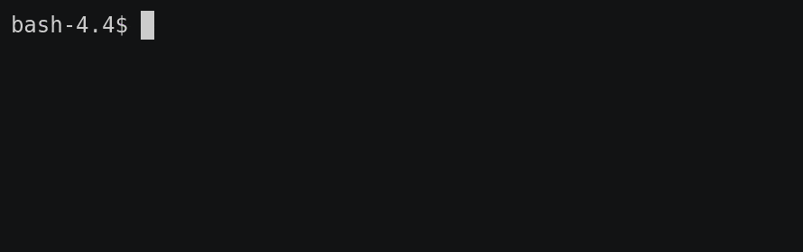

# Rainbow
_Echo in all the colors of the rainbow. Powered by [prism](https://github.com/juanrgon/prism)_



## Install
```sh
go get github.com/juanrgon/rainbow
```

## Usage
The gif above should hopefully be self-explanatory.

However, if you have somehow stumbled upon this and believe that this is exactly what you need, you should really consider using https://github.com/busyloop/lolcat instead; This library is just meant to be used as a demonstration of the capabilities of the go package [prism](https://github.com/juanrgon/prism) and severly limited in comparison
